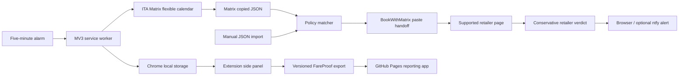

# FareProof

FareProof is a local-first airfare evidence and verification tool. The private Chrome extension captures and stores fare watches; the GitHub Pages app imports the same versioned data for a larger reporting surface. It does not buy tickets, submit passenger or payment information, bypass site controls, or claim that a displayed fare is guaranteed.

## Current extension

The loadable Manifest V3 extension now implements the browser workflow in [prompt.txt](prompt.txt) for the configured Matrix and BookWithMatrix path:

- Five editable default policies for YVR→FRA, YVR→SKG/TIA, both 30–45-day round trips, and corresponding one-way returns. Defaults require two adults, at most CAD 1,600 per person, business/first on legs over six hours, and allow economy on shorter legs. The FRA policies restrict connections to Canada where a connection exists.
- A five-minute central scheduler with one durable owned tab, timeout recovery, rotating date cursors, and no concurrent tab fan-out. Each cycle checks one date per Matrix 30-day flexible-calendar window for every due policy; **Check now** runs a selected policy visibly. If Matrix remains on its spinner, FareProof waits 60 seconds, retries once with a fresh Matrix session, then marks Matrix unavailable and waits for the next policy interval.
- Visible Matrix flexible-date form submission through semantic controls, with the browser-generated base64 URL retained for diagnostics; calendar and flight-result capture; candidate selection under the per-person limit; interception and Zod validation of Matrix's own **Copy itinerary as JSON** output.
- Deterministic validation of route, travel date, passenger count, original-currency per-person price, per-direction stops, connection country, segment duration, mixed cabin, and 30–45-day return window.
- BookWithMatrix handoff through its visible paste workflow, independent retailer links, and fixture-backed observation on its supported retailer hosts.
- Conservative retailer validation. A high-confidence notification requires the retailer page to reproduce route, travel date, flight identity, long-leg cabin tied to the long-haul flight, and original-currency price at or below the policy limit. Missing evidence becomes **manual verification required**, not a match.
- Deduplicated Chrome desktop notifications with **Open match** and **Open FareProof** actions. Optional mobile push uses a user-generated ntfy topic and optional `ntfy.sh` host permission; no mobile data leaves the browser unless explicitly configured.
- Local policy status, observations, alert history, scheduler state, manual JSON import, watch export, and a Shadow DOM Matrix overlay.
- A password-gated static React reporting app for GitHub Pages with local persistence, compact fare import, extension-bundle import, watch filtering, marketing/operating identity reporting, dark/light themes, deletion, and export.
- Unit and fixture coverage for the supplied `WS 5943 / DE 2455`, `D`, `DZ0D0HNS`, `CAD 1,313.67` fare, Matrix calendar/results, BookWithMatrix links, retailer evidence, mixed-cabin policy rules, and an unpacked-extension Playwright test covering the complete Matrix → BookWithMatrix → retailer chain.

Scheduled checks require Chrome and the extension service worker to run. Retailer pages change and may require interaction, login, consent, or CAPTCHA; FareProof reports those states and never bypasses them. The current generic retailer adapter validates visible search/result evidence but does not submit passenger data or advance into payment. IndexedDB evidence history, screenshots, sound, and site-specific checkout-stage adapters remain future work.

Matrix currently logs `ERROR Object` from Google's bundled script when its internal unauthenticated user-info probe returns 401. FareProof does not generate or suppress that console line. When Matrix's fare search also stalls, the Matrix tab shows a FareProof waiting/retry overlay and the policy status records the bounded failure instead of treating it as a match.

## Architecture



The core is intentionally pure and deterministic. Browser access and storage remain at client boundaries. The static web app cannot inspect airfare websites and does not pretend otherwise.

## Requirements

- Node.js 20 or newer
- npm 10 or newer
- Chrome with Developer mode enabled for the extension

## Install and verify

```bash
npm install
npm run typecheck
npm run lint
npm test
npm run build
npx playwright install chromium
npm run test:e2e
npm run test:e2e:extension
```

Use `npm run check` for typecheck, lint, unit tests, and both production builds. The browser test is separate because it requires a Playwright Chromium installation.

## Load the extension

1. Run `npm run build --workspace @fareproof/extension`.
2. Open `chrome://extensions`.
3. Enable Developer mode.
4. Select **Load unpacked**.
5. Choose `packages/extension/dist`.
6. Pin FareProof and open its side panel.
7. Reload the extension from `chrome://extensions` after every rebuild.
8. Open FareProof's side panel. The five requested searches appear under **Scheduled searches**.
9. Click **Check now** on one policy for a visible test, or leave Chrome running for five-minute scheduled cycles.
10. Open **Settings** to edit routes, dates, passenger count, price, stops, long-leg threshold, return window, interval, and notifications.
11. Export captured watches when you want to inspect them in the web app.

The extension requests host access only for Matrix, BookWithMatrix, and the retailer domains BookWithMatrix currently generates or the requested direct-airline checks use. It does not request `<all_urls>`. Mobile ntfy access is optional and requested only after a topic is configured.

## Mobile notifications

Browser notifications work without external services. For mobile alerts:

1. Install the ntfy app on the phone.
2. In FareProof settings, click **Generate private topic** and save.
3. Subscribe to that exact topic in the ntfy app.
4. Use **Send test notification**.

The topic is a bearer-style secret: anyone who knows it can subscribe. Generate a long random topic and do not share it. When enabled, FareProof sends the matching route, price, and URL to `ntfy.sh`; all other fare data remains local.

## Run the web app

```bash
npm run dev:web
```

Open the URL printed by Vite, normally `http://localhost:5173/fareproof/`. The Pages app uses the same password as the port project. Import either the compact fixture shape from the prompt or a JSON bundle exported by the extension after unlocking. Data is stored in browser `localStorage` and is never uploaded by FareProof.

The login follows port's PBKDF2-SHA-256 and AES-GCM pattern. A successful decrypt unlocks the dashboard only in React memory; the password is not stored, and reloading locks the page again. This is a client-side access gate, not server authentication: the encrypted verifier and application assets are public on GitHub Pages, and a determined user can inspect or modify downloaded JavaScript. Do not treat it as protection for secrets or regulated data.

To rotate to a different password, run `npm run encrypt-access --workspace @fareproof/web`, enter the new password locally, and replace `PORT_COMPATIBLE_AUTH_VERIFIER` in `packages/web/src/auth.ts` with the printed value. The script sends nothing over the network and does not store the password.

The deployment workflow in `.github/workflows/deploy.yml` follows the proven static Pages pattern from the attached port project. It runs tests and typecheck, builds `@fareproof/web` with the `/fareproof/` base path, creates an SPA fallback, and deploys on pushes to `main` or manual dispatch. Enable GitHub Pages with **GitHub Actions** as the source in the repository settings.

## Enable GitHub Pages

1. Open the GitHub repository at `https://github.com/MartinDiko/fareproof`.
2. Go to **Settings → Actions → General** and enable GitHub Actions. Allow the GitHub-authored actions used by `.github/workflows/deploy.yml` (`checkout`, `setup-node`, `configure-pages`, `upload-pages-artifact`, and `deploy-pages`), or select **Allow all actions and reusable workflows**.
3. Go to **Settings → Pages**. Under **Build and deployment**, set **Source** to **GitHub Actions**.
4. Open the **Actions** tab and select **Deploy web app to GitHub Pages**. The push to `main` starts it automatically; use **Run workflow** if the initial push happened before Pages was enabled.
5. After the `deploy` job succeeds, open `https://martindiko.github.io/fareproof/`. GitHub also shows the exact deployment URL in the workflow and under **Settings → Pages**.

The workflow already declares `pages: write` and `id-token: write`, uploads `packages/web/dist`, and publishes through the `github-pages` environment. No branch-based `/docs` publishing or separate `gh-pages` branch is needed.

## Package map

- `packages/core`: Zod schemas, normalized fare types, search policies, Matrix URL/JSON contracts, import/export, fingerprints, and deterministic comparisons.
- `packages/extension`: Manifest V3 scheduler, Matrix/BookWithMatrix/retailer adapters, retailer verdicts, notifications, Shadow DOM overlay, popup, settings, and side panel.
- `packages/web`: Static Pages reporting application.
- `tests/e2e`: Browser smoke tests for the public app.

## Adapter development

Each website adapter implements `FareSiteAdapter` and declares capabilities. Add sanitized HTML or JSON fixtures before marking an adapter supported. Extraction order is embedded structured JSON, accessibility attributes, semantic DOM, stable labels, visible text, and finally narrowly scoped selectors. Validate all extracted payloads, debounce dynamic pages, suppress duplicate observations, and preserve both marketing and operating flight identities.

An adapter must never accept terms, sign in, solve CAPTCHA, submit passenger/payment forms, click purchase controls, export cookies, or read unrelated pages. If a page blocks automation or requires interaction, return a manual-action status rather than retrying around the restriction.

## Privacy and permissions

FareProof runs locally in your browser. It does not send fare searches or browsing history to a FareProof server. Imported JSON is capped at 500 KB, parsed as untrusted data, and validated against known schemas. Extension runtime messages are validated and restricted to the extension sender. Website content is rendered as text rather than injected HTML.

The permission set is `storage`, `alarms`, `notifications`, `tabs`, `scripting`, and `sidePanel`. `tabs` and `scripting` drive one extension-owned visible-page verification chain and capture Matrix's own JSON export. There is no automated checkout or purchasing behavior.