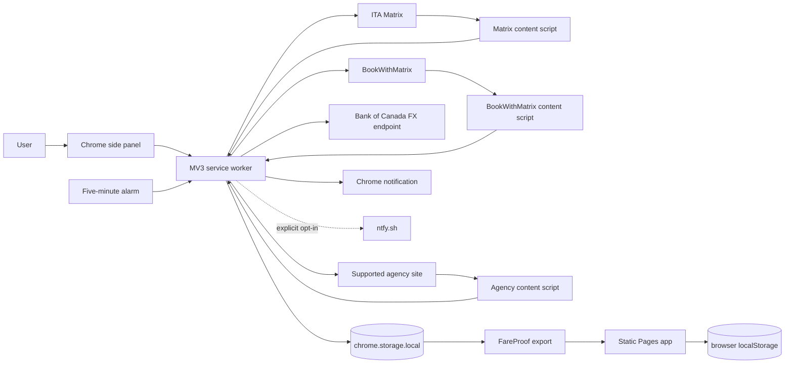
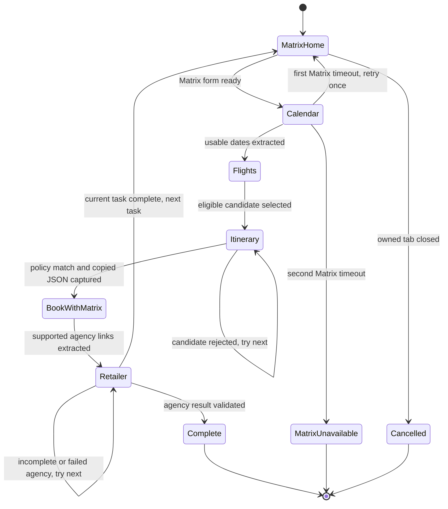
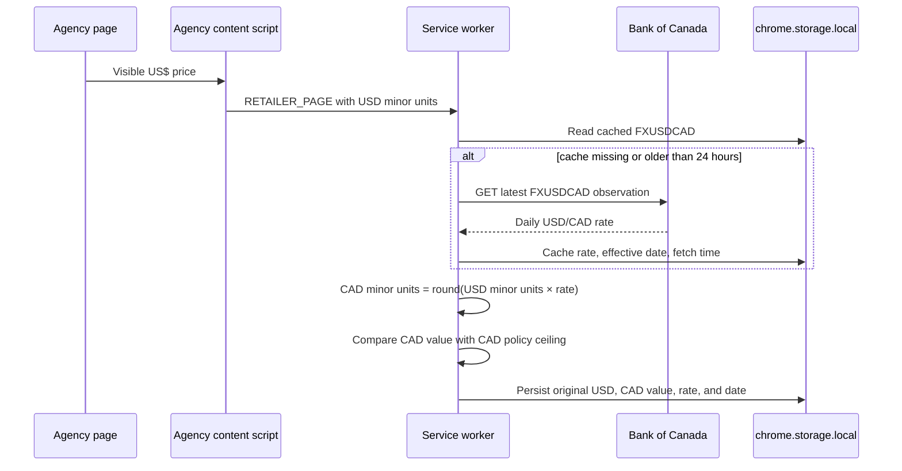

# FareProof architecture

## Purpose and scope

FareProof is a local-first airfare evidence and verification system with two clients: a private Chrome Manifest V3 extension and a static GitHub Pages reporting app. The extension performs browser-visible verification work; the web app imports portable FareProof data for larger-screen review. There is no FareProof backend.

The extension does not purchase tickets, enter passenger or payment details, sign in, accept terms, bypass CAPTCHA or bot controls, or claim that a fare is guaranteed. It records what Matrix, BookWithMatrix, and a supported agency page visibly expose and classifies the result conservatively.

Version 0.2.5 adds durable run history and USD-to-CAD conversion. Run history begins when this version is installed; prior scheduler activity cannot be reconstructed reliably from policy status snapshots.

## System context

## Repository organization

FareProof is an npm-workspace monorepo with three packages.

### `@fareproof/core`

`packages/core` owns browser-independent domain behavior. Both clients consume it.

- `src/domain.ts` defines Zod schemas and TypeScript types for itineraries, segments, money, fare identity, verification stages, watches, comparisons, and portable exports.
- `src/searchPolicies.ts` defines editable fare-search policies, the five requested defaults, policy matching, and linked-return-window checks.
- `src/matrix.ts` builds Matrix search tasks and parses Matrix's copied itinerary JSON into `ObservedItinerary`.
- `src/matching.ts` creates deterministic fingerprints and compares observed itineraries with watches.
- `src/importFare.ts` validates normalized FareProof JSON, compact fare JSON, Matrix copied JSON, and versioned export bundles.
- `src/index.ts` is the package's public API.

Core matching and scoring are pure and deterministic. They do not read browser state, call websites, or persist data.

### `@fareproof/extension`

`packages/extension` owns browser automation, site observation, orchestration, notifications, local extension storage, and the extension UI.

- `src/manifest.ts` declares MV3 permissions, explicit website hosts, content scripts, the service worker, side panel, popup, and options page.
- `src/background/serviceWorker.ts` owns the scheduler, one-tab run state machine, recovery, evidence persistence, run history, alerts, and navigation between sites.
- `src/background/retailerValidation.ts` compares normalized agency-page evidence with a policy and Matrix itinerary.
- `src/background/exchangeRates.ts` fetches, validates, caches, and applies the Bank of Canada USD/CAD rate.
- `src/background/matrixCandidateRanking.ts` ranks eligible Matrix candidates by price and then duration.
- `src/content/ita` observes and operates Matrix through visible semantic controls.
- `src/content/bookwithmatrix` submits Matrix copied JSON through BookWithMatrix's visible paste control and extracts independent agency links.
- `src/content/retailer` passively extracts route, flight, date, cabin, price, and blocker evidence from supported agency pages.
- `src/shared/messages.ts` validates every extension/content-script message with a Zod discriminated union.
- `src/shared/state.ts` validates persisted policies, status, active runs, observations, FX data, and run history.
- `src/ui` contains the side panel, policy dashboard, evidence panel, run history, popup, and settings UI.

### `@fareproof/web`

`packages/web` is a static React application deployed to GitHub Pages.

- `src/auth.ts` implements the port-compatible PBKDF2-SHA-256/AES-GCM password verifier.
- `src/Login.tsx` collects the password and unlocks the app in React memory.
- `src/App.tsx` imports, filters, displays, deletes, and exports FareProof watches.
- Web data remains in browser `localStorage`; the app has no browser-extension privileges and cannot inspect airfare sites.

## Extension runtime topology

The extension uses four execution contexts.

1. The MV3 service worker is the authority for scheduler state, navigation, validation, persistence, and notifications.
2. Matrix, BookWithMatrix, and agency content scripts observe untrusted pages and send validated facts to the worker.
3. The side panel reads validated local storage and sends explicit commands such as **Check now**.
4. A short Matrix main-world script intercepts Matrix's own clipboard write when the user-visible **Copy itinerary as JSON** action is triggered; the payload is returned to the isolated content script and validated before use.

No website DOM object crosses a context boundary. Content scripts send bounded structured messages, and the service worker validates every message before acting on it.

## Verification run lifecycle

One run owns one Chrome tab and a serial task queue. This prevents concurrent tab fan-out and keeps site state attributable to a single run.

### Starting a run

The five-minute `fareproof.dispatch` alarm calls `dispatchDuePolicies()`. Manual **Check now** sends `RUN_POLICIES_NOW`. Both paths first call `recoverScheduler()` so stale durable state cannot silently block a new run.

`startRun()` snapshots the selected policies, creates Matrix tasks, opens one owned tab, persists `ActiveVerificationRun`, and inserts a `RunHistoryEntry` with outcome `running`. Only the first policy is marked `running`; later policies are marked queued rather than implying that five searches are executing concurrently.

### Matrix stages

At `matrix-home`, the content script reports readiness and receives a `RUN_MATRIX_SEARCH` command containing one validated task and policy. The script operates Matrix's visible controls for trip type, airports, flexible dates, passengers, stops, cabin, and CAD currency.

At `calendar`, the script extracts visible calendar dates and prices. The worker filters the current task window, prefers entries in policy currency under the policy ceiling, rotates through dates using a durable task cursor, and asks the page to select one date.

At `flights`, the script publishes usable itinerary links even if Matrix still shows row-level progress indicators. The worker filters by policy currency and maximum per-person price, ranks by lowest price and then shortest duration, and retains up to five candidates.

At `itinerary`, the worker triggers Matrix's copy action, captures the copied JSON, parses it through `@fareproof/core`, and evaluates the route, dates, passenger count, price, stops, connection country, segment duration, cabin, and linked-return rules. A failed candidate advances to the next candidate. A policy match advances to BookWithMatrix.

### BookWithMatrix stage

The worker navigates the owned tab to BookWithMatrix and sends the raw Matrix JSON to the BookWithMatrix content script. The script uses the visible paste control and extracts each `Book with …` HTTPS link as an independent handoff.

BookWithMatrix acceptance is not a validated fare. The worker records it as a pending handoff, filters links to explicitly supported hosts, queues up to six agencies, and navigates to the first agency.

### Agency stage

The agency content script observes progressively rendered pages and extracts bounded visible evidence:

- Airport codes.
- Marketing and operating flight numbers.
- Date tokens.
- Cabin words tied to nearby flight identity.
- CAD, USD, EUR, and GBP price tokens with per-person, total, or unknown basis.
- CAPTCHA, login-required, unavailable, and price-changed blockers.

`validateRetailerObservation()` compares this evidence with the Matrix itinerary and policy. Route, travel date, flight identity, long-leg cabin, and price must all be present. Missing evidence stays pending while the page renders. Contradictory evidence advances to the next agency. Blockers are reported but never bypassed.

The agency's visible price is the source of truth. A validated booking action requires a current agency HTTPS URL, complete evidence, and an agency price at or below the CAD policy limit. Matrix and BookWithMatrix prices remain comparison evidence only.

## USD-to-CAD conversion

FareProof converts USD agency or BookWithMatrix prices to CAD before applying a CAD policy limit.

The rate endpoint is `https://www.bankofcanada.ca/valet/observations/FXUSDCAD/json?recent=1`. Its response is validated with Zod. A rate fetched within 24 hours is reused. If refresh fails, a previously validated cached rate may be used. If no rate is available, USD price validation remains incomplete and no booking action is enabled.

The request sends no itinerary, route, fare, policy, or user identifier to the Bank of Canada. The extension only requests the public exchange-rate observation.

The UI displays `US$` and `CA$` explicitly, shows the original agency quote beside its CAD equivalent, and includes the rate and effective date. Conversion currently supports USD→CAD only. Extracted EUR or GBP values are not converted or used to satisfy a CAD policy.

## Durable state

All extension product state is stored in `chrome.storage.local` and validated on read.

| Storage key | Schema or shape | Purpose |
| --- | --- | --- |
| `fareproof.searchPolicies` | `FareSearchPolicy[]` | Five defaults plus user edits. |
| `fareproof.policyStatuses` | `PolicyStatus[]` | Current policy state, message, attempt/completion times, next due time, and best CAD price. |
| `fareproof.activeVerificationRun` | `ActiveVerificationRun` or `null` | The one owned-tab workflow and its task/stage queues. |
| `fareproof.policyObservations` | `PolicyObservation[]` | Matrix, BookWithMatrix, agency, price, FX, and rule evidence; capped at 200 entries. |
| `fareproof.runHistory` | `RunHistoryEntry[]` | One durable summary for every run started after version 0.2.5. |
| `fareproof.dateCursors` | `Record<string, number>` | Rotating Matrix date index per task. |
| `fareproof.usdCadRate` | `UsdCadRate` | Validated Bank of Canada rate, effective date, and fetch time. |
| `fareproof.notificationSettings` | `NotificationSettings` | Browser notification toggle and optional ntfy topic. |
| `fareproof.alertLinks` | URL map | Opens validated or review URLs from notification actions. |
| `fareproof.watches` | `FareWatch[]` | User-created fare watches. |
| `fareproof.currentObservation` | `ObservedItinerary` | Latest observed Matrix page used by the side panel. |

### Run history

Each `RunHistoryEntry` stores the run ID, manual or scheduled trigger, start/completion times, final stage, task and policy counts, aggregate outcome, summary, and policy-level results.

Policy-level results snapshot the policy name and route so later policy edits do not rewrite history. They may also store agency name, validated booking URL, CAD per-person price, original USD per-person price, USD/CAD rate, effective date, outcome, and explanatory message.

Aggregate outcomes are `running`, `match`, `no-match`, `manual-review`, `matrix-unavailable`, `cancelled`, or `failed`. A Matrix site outage creates one `matrix-unavailable` run row and marks affected policy statuses `blocked`; it is not represented as five FareProof errors.

Run history is intentionally local and is not included in the current version-one watch export schema. The history array is not automatically truncated. Observation evidence remains capped independently at 200 entries.

## Failure and recovery semantics

Stage-specific alarms bound each run:

| Stage | Timeout |
| --- | ---: |
| Matrix home | 20 seconds |
| Matrix calendar | 60 seconds |
| Matrix flights | 120 seconds |
| Matrix itinerary | 60 seconds |
| BookWithMatrix | 45 seconds |
| Agency | 30 seconds |

Matrix calendar failure is retried once with a fresh Matrix session. If the second attempt fails, the run ends as `matrix-unavailable`, affected policies show their next retry time, and the scheduler waits for the next interval. Matrix's site-generated console `ERROR Object` is not treated as a FareProof exception.

If an owned tab disappears, the current policy becomes `manual-action-required`, later queued policies return to scheduled state, and the run history records `cancelled`. If persisted state is stale while its tab still exists, the current policy records an extension error, later queued policies return to scheduled state, and run history records `failed`.

Agency pages may render partial route or price data. An empty shell or origin-only page remains pending until the agency timeout; it is not classified as a route mismatch. A visibly different complete route, over-limit price, explicit unavailability, or repricing message is contradictory evidence and advances to the next agency.

## Side-panel information architecture

The side panel is ordered by decision relevance:

1. **Fare evidence** shows the current result and, when different, the latest validated booking result.
2. **Run history** lists every recorded run newest first. Rows expand to show per-policy outcomes, original and CAD prices, rate metadata, and booking links.
3. **Scheduled searches** shows enabled, agency-match, and Matrix-unavailable totals; one run-level availability notice; current run progress; and editable policy cards.
4. **Captured watches** contains manually imported or captured watch targets.
5. **Manual JSON import** accepts FareProof, Matrix copied, or compact JSON.

Status tones distinguish validated matches, active work, upstream availability, manual review, and actual extension errors. Matrix availability copy is shown once at run level rather than repeated as an error paragraph on every policy card.

## Message contracts

`extensionMessageSchema` validates messages entering the service worker. Major page-originated messages are:

- `MATRIX_HOME_READY`, `MATRIX_CALENDAR`, `MATRIX_FLIGHTS`, `MATRIX_ITINERARY_READY`, `MATRIX_ITINERARY`, and `MATRIX_CAPTURE_FAILED`.
- `BOOKWITHMATRIX_READY` and `BOOKWITHMATRIX_RESULTS`.
- `RETAILER_PAGE` with bounded structured evidence.
- `PAGE_OBSERVATION` for the current observed itinerary.

Major UI commands are `CREATE_WATCH`, `SAVE_SEARCH_POLICIES`, `RUN_POLICIES_NOW`, `RECOVER_SCHEDULER`, `SAVE_NOTIFICATION_SETTINGS`, and `TEST_NOTIFICATION`.

`contentCommandSchema` validates commands sent to site scripts: `RUN_MATRIX_SEARCH`, `SELECT_MATRIX_DATE`, `CAPTURE_MATRIX_JSON`, and `SUBMIT_BOOKWITHMATRIX`.

Messages from tabs are accepted only when the sender tab owns the active run. Messages from unrelated tabs cannot advance scheduler state.

## Notifications

Browser notifications are local and enabled by default. A high-confidence notification is generated only after agency validation. Notification history suppresses duplicate or weaker alerts unless the price improves, confidence improves, or 24 hours pass.

Optional mobile delivery uses a user-generated ntfy topic and optional `https://ntfy.sh/*` permission. When enabled, FareProof sends the matching route, price, and URL to ntfy. No other remote notification service is used.

## Static reporting app

The Pages app receives data only when the user imports a FareProof bundle or supported JSON. It cannot communicate with extension storage or inspect browser tabs.

The password gate derives an AES-GCM key using PBKDF2-SHA-256 and attempts to decrypt a fixed verifier. The password and unlocked plaintext are never persisted. Reloading locks the app again. This is client-side access obfuscation for a static site, not server authentication.

Imported watches are validated through `@fareproof/core`, stored in `localStorage`, and rendered in a filterable table. The user may delete records or export a new versioned bundle.

## Permissions and trust boundaries

FareProof does not request `<all_urls>`. Required hosts are explicit Matrix, BookWithMatrix, supported agency/airline domains, and the Bank of Canada FX endpoint. ntfy is optional.

Website content is untrusted. It is parsed as text or structured JSON and validated before use. The extension does not use `eval`, remotely hosted executable code, cookies, session tokens, payment data, or `dangerouslySetInnerHTML`.

The extension's CSP is `script-src 'self'; object-src 'self'`. All executable extension assets are bundled locally.

The owned verification tab remains user-visible for manual runs. Scheduled runs may close their owned tab after completion. FareProof does not hide automation from the user or attempt to defeat website controls.

## Build and deployment

The root workspace uses TypeScript, Vite, React, Zod, Vitest, Playwright, ESLint, and Prettier.

`npm run check` runs strict typechecks for all workspaces, lint, unit tests, and all production builds. `npm run test:e2e:extension` builds and loads the unpacked extension in Chromium, then exercises the Matrix→BookWithMatrix→agency path. `npm run test:e2e` also covers the Pages app.

CRXJS and Vite build the unpacked extension into `packages/extension/dist`. Chrome loads that directory through **Load unpacked**. After rebuilding, **Reload** on `chrome://extensions` preserves the extension ID and local data.

`.github/workflows/deploy.yml` runs on pushes to `main` and manual dispatch. It installs with `npm ci`, runs shared tests and typechecks, builds `@fareproof/web`, creates an SPA fallback, uploads the Pages artifact, and deploys through the `github-pages` environment.

The GitHub Pages workflow deploys only the static web app. The private extension is not published to the Chrome Web Store and must be built and loaded locally.

## Test strategy

Unit tests cover Matrix parsing, policy matching, linked return windows, candidate ranking, retailer validation, USD conversion, evidence view models, site adapters, and web authentication.

Sanitized HTML and JSON fixtures cover Matrix calendar/results, copied itinerary JSON, BookWithMatrix links, agency route/flight/cabin/date/price extraction, codeshare identity, and dynamic agency loading.

The unpacked-extension Playwright test verifies stale-run recovery, Matrix retry, copied-JSON import, Matrix candidate selection, BookWithMatrix handoff, delayed agency rendering, USD→CAD conversion, evidence display, booking-link gating, notifications, durable run history, shared Matrix-unavailable status, and scheduled recovery without console errors.

The optional live Matrix test is gated by `FAREPROOF_LIVE_TEST=true` because it calls an external site and may fail when Matrix is unavailable independently of FareProof.

## Current limitations

- Site adapters depend on visible page evidence and may require maintenance when websites change.
- Only hosts with fixture-backed extraction are treated as supported; other BookWithMatrix links require manual review.
- FareProof does not complete checkout or guarantee that a fare remains available after the observed page.
- USD→CAD is the only implemented currency conversion. EUR and GBP may be observed but cannot satisfy a CAD price rule automatically.
- Bank of Canada rates are daily averages, not card-network or agency settlement rates.
- The run ledger begins with version 0.2.5 and cannot reconstruct earlier runs.
- Run history is local and currently has no export or delete control.
- Observation evidence is capped at 200 entries; run summaries are not automatically capped.
- Extension and web storage do not synchronize automatically.
- Scheduled checks require Chrome to be running and the MV3 worker to be available.
- Matrix, BookWithMatrix, agencies, and ntfy are external dependencies outside FareProof's availability control.